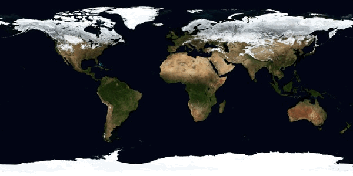

# STMovingImages
Create .MOV and .GIF from NSImages in Swift 3

#### Create .GIF

For macOS and iOS

	let gm = STGIFMaker(destinationPath: "/tmp/test.gif", loop: true)!
	
	for i in images {
	    gm.append(image: i, duration: 0.5)
	}
	
	gm.write()

#### Create .MOV

For macOS only (for now)

	let mm = STMovieMaker(path: "/tmp/test.mov",
	                 frameSize: CGSize(width:600, height:300),
                           fps: 2)!
	
	for i in images {
	    mm.append(i)
	}
	
	mm.write { (path) in
	    //
	}
